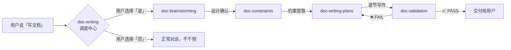

# Doc Writing Skills

> 让 CodeBuddy 按照结构化流程写出高质量文档 — brainstorming → constraints → writing plan → validated writing。

## 这套 skill 解决什么问题

直接让 AI 写文档，常见的问题是：

- **跑偏** — 写到一半才发现方向不对，返工成本高
- **缺乏结构** — AI 倾向于一次性输出全文，没有章节级别的质量把关
- **不符合预期** — 没有充分理解读者、范围、风格就开始写，产出和需求脱节

Doc Writing Skills 通过 **4 阶段工作流** 解决这些问题：

1. **Brainstorming** — 通过结构化对话，理清目的、读者、范围和风格
2. **Constraints** — 从对话中提取可验证的写作约束，形成 single source of truth
3. **Writing Plan** — 按章节拆分写作任务，逐节执行
4. **Validation** — 每节写完后自动校验约束，不通过则修复后重新校验

亮点：**调度中心门控设计** — `doc-writing` 作为调度中心始终监听，检测到写作意图时主动询问用户是否启用工作流，不需要时完全不干扰正常对话。

## 工作流总览



| Skill | 职责 |
|-------|------|
| `doc-writing` | 调度中心（dispatcher） — 检测写作意图，询问用户是否启用工作流 |
| `doc-brainstorming` | 通过结构化提问，理清文档的目的、读者、范围和风格 |
| `doc-constraints` | 从 brainstorming 结果中提取可验证的写作约束 |
| `doc-writing-plans` | 按章节拆分写作任务，逐节执行并调用 validation |
| `doc-validation` | 校验每节内容是否符合约束，不通过则阻止交付 |

## 安装

### CodeBuddy

#### 前置条件

- [CodeBuddy](https://codebuddy.ai) 已安装且支持 skill 导入功能

#### 步骤

1. 克隆本仓库：

```bash
git clone https://github.com/your-org/doc-writing-skills.git
```

2. 在 CodeBuddy 中，点击 **Skill 管理** 面板底部的 **「导入技能」** 按钮

3. 依次导入 `skills/` 目录下的 5 个 skill：

| 顺序 | 目录 | 说明 |
|------|------|------|
| 1 | `skills/doc-writing/` | 调度中心，建议设置为 `alwaysApply` |
| 2 | `skills/doc-brainstorming/` | Brainstorming 阶段 |
| 3 | `skills/doc-constraints/` | Constraints 提取 |
| 4 | `skills/doc-writing-plans/` | 写作计划与执行 |
| 5 | `skills/doc-validation/` | 内容校验 |

4. 确认 `doc-writing` 已设为 **始终生效**（alwaysApply），其余 4 个 skill 为按需加载

5. 开一个新对话，说「帮我写一篇文档」— 如果调度中心弹出确认提示，安装成功 ✅

> **💡 提示**：`doc-writing` 作为调度中心需要 `alwaysApply` 才能自动检测写作意图。如果不想让它始终生效，也可以设为手动加载，在需要时手动触发。

### Cursor

<details>
<summary>🚧 Coming Soon</summary>

Cursor 的 skill/rule 机制与 CodeBuddy 不同，适配工作进行中。

预计安装方式：将 `SKILL.md` 内容转换为 `.cursorrules` 文件放入项目根目录。

</details>

### Claude Code

<details>
<summary>🚧 Coming Soon</summary>

Claude Code 使用 `CLAUDE.md` 作为 project instructions。适配工作进行中。

预计安装方式：将 skill 内容整合到 `.claude/` 目录下的 command 文件中。

</details>

## 使用示例

以下是一段典型的使用流程（简化版）：

---

**User**: 帮我写一篇关于项目 API 的技术文档

**Assistant**: 检测到你可能需要写文档，是否启用 doc-writing 完整工作流？（brainstorming → constraints → writing plan → validated writing）

> - ✅ 是，启用完整工作流
> - 否，直接开始写

**User**: 是，启用完整工作流

**Assistant**: *（加载 `doc-brainstorming`）*

I'm using doc-brainstorming to understand your writing goals before we start.

这篇文档的主要目的是什么？

> - API 参考手册 — 列出所有端点、参数、返回值
> - 集成指南 — 教第三方开发者接入
> - 内部文档 — 给团队成员参考

**User**: 集成指南

**Assistant**: *（继续提问读者、范围、风格...）*

*（提问结束后，提出 2-3 个文档结构方案，用户选择后...）*

**Assistant**: *（加载 `doc-constraints`）*

I'm using doc-constraints to distill the core rules for this document.

```
约束文件已生成：
- C01: 面向外部开发者，不使用内部术语
- C02: 所有 API 端点用 backtick + HTTP method 格式
- C03: 每个章节包含可运行的代码示例
  ...
```

**User**: 没问题

**Assistant**: *（加载 `doc-writing-plans`）*

I'm using doc-writing-plans to create and execute the writing plan.

*（按章节逐节写作，每节自动调用 `doc-validation` 校验约束...）*

```
✅ Validation Report: Section 1 — 概述
VC01: ✅ PASS
VC02: ✅ PASS
VC03: ✅ PASS
Result: PASS
```

*（校验通过，交付给用户审阅 → 进入下一节...）*

---

> **💡 如果选择「否，直接开始写」**，调度中心会完全退出，不会加载任何子 skill，AI 以正常方式回答你的请求。

## 各 Skill 详细说明

### `doc-writing` — 调度中心（Dispatcher）

| 项目 | 说明 |
|------|------|
| **职责** | 检测用户的写作意图，询问是否启用完整工作流 |
| **触发条件** | 用户消息中包含写文档/创建/起草等意图关键词 |
| **不触发** | 小修改、typo 修复、代码注释、阅读/总结已有文档 |
| **加载方式** | `alwaysApply`（始终生效） |
| **输出** | 用户确认后，加载 `doc-brainstorming` 进入工作流 |
| **下游** | → `doc-brainstorming` |

**关键设计**：调度中心永远不会自动启动工作流，必须先询问用户。如果用户拒绝，调度中心在本次对话中完全退出，不再干预。

---

### `doc-brainstorming` — 需求探索

| 项目 | 说明 |
|------|------|
| **职责** | 通过结构化对话，理清文档的目的、读者、范围和风格 |
| **触发条件** | 由 `doc-writing` 加载 |
| **输入** | 用户的写作意图 + 项目上下文（自动探索已有文件） |
| **输出** | 一份确认的文档设计方案（结构、要点、边界） |
| **下游** | → `doc-constraints` |

**工作方式**：

1. 自动探索项目上下文（已有文件、最近工作等）
2. 逐个提问（每次一个问题，偏好多选题）：目的 → 读者 → 范围 → 风格
3. 提出 2-3 个文档结构方案，推荐最优方案
4. 逐章节展示大纲，获得用户确认
5. 确认后自动调用 `doc-constraints`

---

### `doc-constraints` — 约束提取

| 项目 | 说明 |
|------|------|
| **职责** | 从 brainstorming 结果中提取可验证的写作约束 |
| **触发条件** | 由 `doc-brainstorming` 完成后调用 |
| **输入** | brainstorming 确认的文档设计方案 |
| **输出** | `doc-writing-constraints.md` 约束文件 |
| **下游** | → `doc-writing-plans` |

**约束文件包含**：

- **Core Concepts** — 核心术语定义和使用规则
- **Constraints** — 可验证的写作规则（如 "C01: 所有 API 名称用 backtick"）
- **Validation Checklist** — 与约束一一对应的校验清单
- **Change Log** — 约束变更记录

**核心原则**：每条约束必须是可验证的，不接受模糊表述（如 ~~"写清楚一点"~~），必须是具体规则（如 "每段不超过 5 句"）。

---

### `doc-writing-plans` — 写作计划与执行

| 项目 | 说明 |
|------|------|
| **职责** | 按章节拆分写作任务，逐节执行写作 |
| **触发条件** | 由 `doc-constraints` 完成后调用 |
| **输入** | `doc-writing-constraints.md` 约束文件 |
| **输出** | 完成的文档内容（逐节交付） |
| **下游** | 每节 → `doc-validation` → 用户 |

**工作方式**：

1. 读取约束文件，生成按章节的写作计划
2. 逐节执行：写作 → 自动校验 → 交付用户
3. 如果校验失败，自动修复后重新校验
4. 如果发现约束过时（constraint drift），主动向用户提出更新建议

---

### `doc-validation` — 内容校验

| 项目 | 说明 |
|------|------|
| **职责** | 校验写作内容是否符合约束文件中的所有规则 |
| **触发条件** | 由 `doc-writing-plans` 在交付每节内容前自动调用 |
| **输入** | 一节写作内容 + `doc-writing-constraints.md` |
| **输出** | Validation Report（每条 VC 的 PASS/FAIL 结果） |
| **下游** | PASS → 交付用户 / FAIL → 返回 `doc-writing-plans` 修复 |

**校验报告示例**：

```
## Validation Report: Section 2 — 安装指南

| ID   | Rule              | Result  | Detail            |
|------|-------------------|---------|-------------------|
| VC01 | 正文使用中文       | ✅ PASS | —                 |
| VC02 | 术语用英文         | ✅ PASS | —                 |
| VC03 | skill 名用 backtick | ❌ FAIL | 第 3 段 "doc-writing" 未加 backtick |

Result: FAIL (1 violation)
```

**关键规则**：校验不通过的内容不会交付给用户，必须修复后重新校验。

## License

MIT

